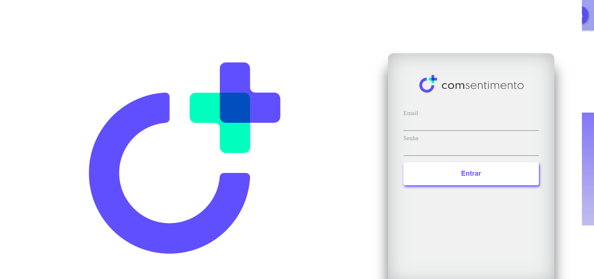
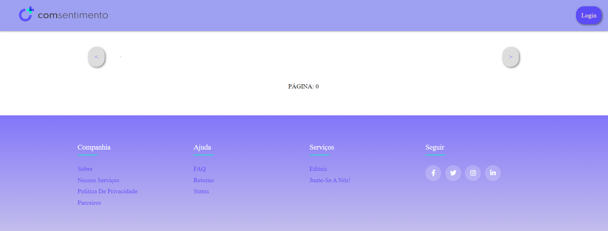
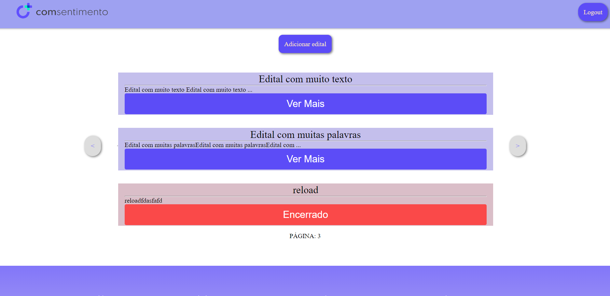
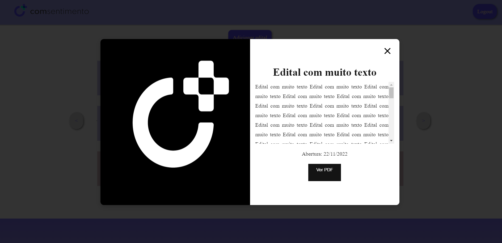

# Comsentimento - Gerência de editais
Front do projeto desenvolvido para realizar gerência de editais de seleção do ensino superior. Consumindo uma API também desenvolvida para esse projeto, foi feita uma tela de login, tela de exibição de editais cadastrados, formulário disponível para administradores para cadastro de novos editais e uso de uma modal para exibir detalhes dos editais.

## 💻 Link do surge
comsentimento-flavio.sh

## 🛠 Ferramentas e Tecnologias
- React
- Material UI
- Axios
- Styled Components
- Node.js

## Como executar
- Clone o projeto para um repositório local 
- Execute `npm i` para instalar as dependências.
- Após finalizar a instalação execute `npm run start` para iniciar a aplicação
- - É necessário executar a API para fazer as requisições ao backend

## ⚙️ Funcionalidades
### Login
Página de Login em que o usuário se habilita a criar e remover editais.
Com inputs para o usuário entrar com sua conta com e-mail e senha.
Quando o usuário fizer login o botão logout fica disponível no header.

### Página de editais
Página para listar os editais criados por adminstradores.
Nesta página, caso o usuário seja administrador o botão de criar um novo edital estará habilitado, caso contrário o botão não estará disponível.
Ao preencher o formulário, é possível informar título, descrição, data de criação, se está ativo e enviar um PDF ao servidor
São exibidos 3 editais por vez, a paginação é feita por parâmetro e também por botões disponíveis na página.
É possível ver se o edital está ou não ativo, isso é feito de modo visual.
Ao clicar para visualizar um edital abrirá uma modal
Ao carregar alguma requisição o usuário visualiza um loading para saber que está sendo carregada

### Modal de detalhes
É possível visualizar todos os detalhes do edital, também visualizando data de início do edital, status, título e detalhes.
Um botão para fazer download do PDF do edital aparece, sendo exibido se o edital está ativo atualmente ou não.

## ⚙️ O que não funciona (ainda)
Baixar PDF armazenado no backend
Excluir edital (Back já tem a funcionalidade)
Editar edital (Back já tem a funcionalidade)

## Prints do projeto

